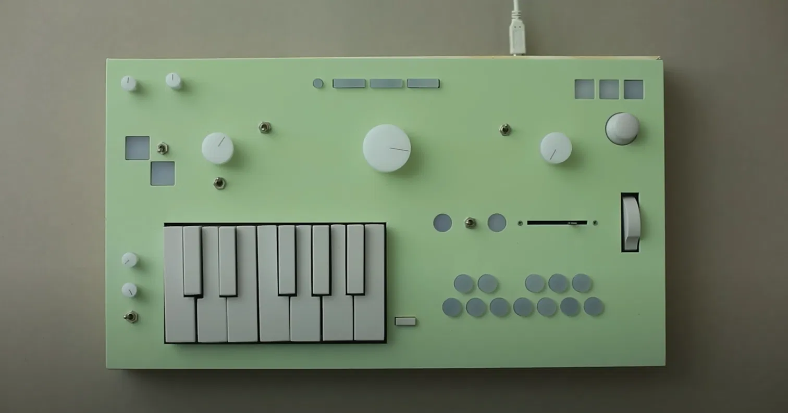

The [nopia mk1](https://nopia.io) is a fantastic prototype synthesizer.



## What's this?

A browser harmony instrument inspired by the Nopia, played from a MIDI keyboard over Web MIDI.
Design: [docs/superpowers/specs/2026-10-01-nopia-web-design.md](docs/superpowers/specs/2026-10-01-nopia-web-design.md).

Live: <https://cosimo.github.io/webmidi-nopia-mk1/> (deployed from `main` by
[.github/workflows/pages.yml](.github/workflows/pages.yml)).

### Run it

```bash
npm install
npm run dev
```

Open <http://localhost:5173> in Chrome or Edge (in Windows, when developing in WSL2), allow MIDI
access when asked, and click to start audio.

### Test

```bash
npm test            # unit tests (Vitest)
npm run e2e         # browser tests (Playwright with a fake Web MIDI)
npm run typecheck
```

### Play

- Keys below the split point (default C4 = 60) play chords: each key is a scale degree, all 12 are
  harmonized. Keys from the split point up play the melody.
- Hold the key-select key (default G5 = 79, the M32's top key) and press a chord key to change the key.
- Left of the display: Real/Static layout, Major/Minor, Secondary dominants/Borrowed table, Extensions.
- Each module (Keys, Pad, Bass, Melody, Arp, Strum) can sound internally and/or go to a MIDI port
  and channel.
- Under the Extensions knob: Tempo (knob or field), Tap tempo, and Click (metronome).
- The Arp (enable it in its module settings) plays the held chord on the tempo grid; its pattern,
  rate, octaves and gate are in its settings.
- The mod strip (CC1) strums the held chord. Settings → Mod strip switches it to Melody vibrato.
- The looper (header): **Verse**, **Chorus**, **Bridge** slots with **Rec** (record from the next
  bar; again to stop at the end of the bar and loop; again to overdub), **Play** (play/stop) and
  **Clear**. Selecting another slot while one plays switches at the end of the loop. Loops follow
  later key, mode and Extensions changes.
- Settings: split point, key-select note, master FX, control mappings with MIDI learn.
- Panic silences everything, internal and MIDI.

Hardware checklists: [milestone 1](docs/hardware-check-m1.md), [milestone 2](docs/hardware-check-m2.md),
[milestone 3](docs/hardware-check-m3.md).
